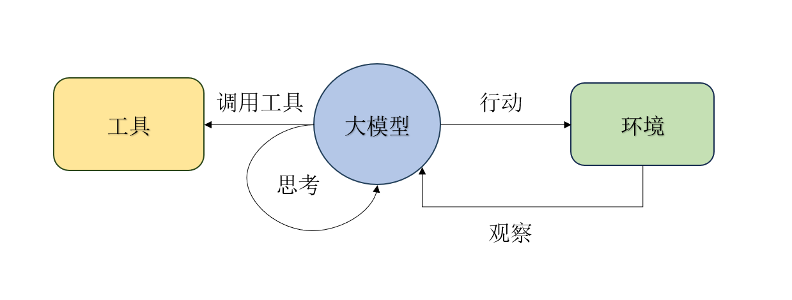
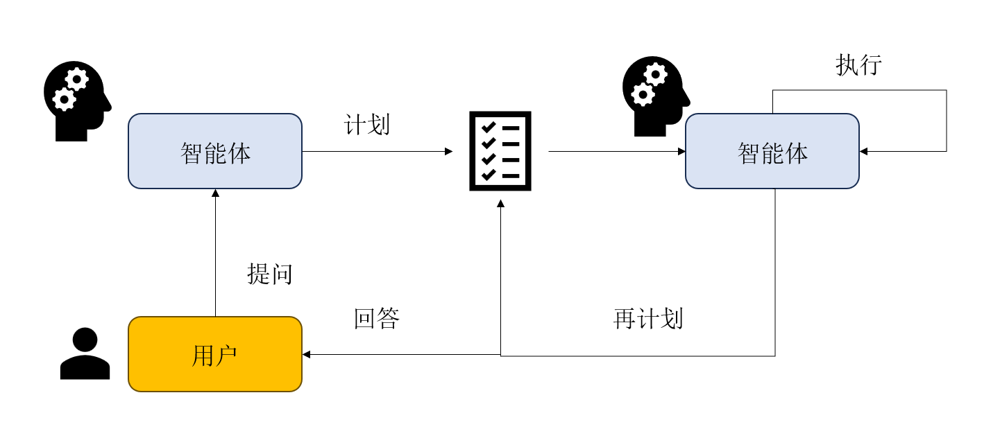

# 智能体的简单构建

# 环境配置

## 安装依赖库

首先需要安装python-dotenv库

python-dotenv 是一个专门用于从 .env 文件加载环境变量到 Python 程序中的库。它可以帮助我们将配置信息从代码中分离出来，以一种更加安全、灵活的方式进行管理。


> 在实际开发中，我们常常会遇到以下问题：
>
> - **敏感信息泄露风险**：如果将敏感信息直接写入代码，一旦代码被泄露，这些信息也会随之曝光，给系统带来巨大的安全隐患。
> - **环境切换困难**：不同的开发环境（开发、测试、生产等）可能需要不同的配置信息。如果配置信息直接写在代码中，每次切换环境都需要手动修改代码，这不仅繁琐，还容易出错。
> - **代码可维护性差**：将配置信息与代码混在一起，会使代码结构变得混乱，难以维护和扩展。
>
> 而 python-dotenv 的出现，正是为了解决这些问题。通过使用 .env 文件来存储配置信息，并利用 python-dotenv 将这些信息加载到程序中，我们可以轻松地实现配置信息的分离和管理。


安装很简单

```powershell
pip install openai python-dotenv
```


## 配置.env文件


```\
# .env file
LLM_API_KEY="YOUR-API-KEY"
LLM_MODEL_ID="YOUR-MODEL"
LLM_BASE_URL="YOUR-URL"
```

调用.env文件也很简单，直接使用以下代码

```python
load_dotenv(dotenv_path="config/.env") #参数可以不要，默认路径就是当前python文件的目录
```

**注意，这里的.env文件命名就是".env"，在.前面不要加任何其它名字**


# 封装大模型调用类

```python
class LLMs:
    def __init__(self, model : str = None, apiKey : str = None, url : str = None, timeout : int = None):
        #初始化，提供大模型的api_key, name, url
        if(model is None) : self.model = os.getenv("LLM_MODEL_ID")
        if(model is None) : apiKey = os.getenv("LLM_API_KEY")
        if(model is None) : url = os.getenv("LLM_BASE_URL")
        if(model is None) : timeout = int(os.getenv("LLM_TIMEOUT", 1200))

        if self.model == None or apiKey == None or url == None:
            raise ValueError("模型ID、API密钥和服务地址缺少, 可能没有在.env文件中定义, 或者.env文件路径问题")#强制中断
        
        self.client = OpenAI(api_key=apiKey, base_url=url, timeout=timeout) #模型需要支持openai调用,可以查阅模型的api文档，一般会提供可供openai使用的接口

    def think(self, messages : List[Dict[str, str]], temperature : float = 0) -> str:
        print(messages)
        print(f"正在调用{self.model}模型...")

        try:
            response = self.client.chat.completions.create(
                model=self.model,
                messages=messages,
                max_tokens=65536,
                temperature=temperature,
                stream=True,
            )

            print("大模型响应成功")
            #流式输出
            response_content = []
            for chunk in response:
                content = chunk.choices[0].delta.content or ""
                print(content, end="", flush=True)
                response_content.append(content)
            print()  # 在流式输出结束后换行
            return "".join(response_content)
        
        except Exception as e:
            print(f"调用LLM API时发生错误: {e}")
            return None
```


# ReAct范式

关键词：思考-行动-观察，循环

## 工作流程

通过提示工程来引导模型，使得其每一步都遵循

* 先思考：分析当前情况、分解任务、制定下一步计划，或者反思上一步的结果
* 再行动：智能体决定采取的具体动作，通常是调用一个外部工具
* 最后观察：从外部工具返回的结果

循环往复，将新的观察结果添加到历史记录中，知道认为已经找到了最终答案，最后输出结果。



## 适用场景

1. 需要外部知识的任务：如查询天气
2. 需要精确计算的任务：将数学问题交给计算器工具
3. 需要与API交互的任务：如操作数据库


## 实现方式

### 环境配置

以搜索为例，可以使用**SerpApi**，该网站提供结构化的Google搜索结果，返回的结果更精确

先安装库

```
pip install google-search-results
```

然后在SerpApi注册一个免费账户，获取apikey，同样添加到.env文件中

```
# .env file
# ... (保留之前的LLM配置)
SERPAPI_API_KEY="YOUR_SERPAPI_API_KEY"
```


### 工具的定义

调用serpapi来搜索

```python
def search(query: str) -> str:
    try:
        api_key = os.getenv("SERPAPI_API_KEY")
        if api_key is None:
             raise ValueError("缺少api key")
        
        params = {
            "engine" : "google",
            "q" : query,
            "api_key" : api_key,
            "gl" : "cn",
            "hl" : "zh-cn"
        }

        client = SerpApiClient(params)

        results = client.get_dict()


        if "answer_box_list" in results:
            return "\n".join(results["answer_box_list"])
        if "answer_box" in results and "answer" in results["answer_box"]:
            return results["answer_box"]["answer"]
        if "knowledge_graph" in results and "description" in results["knowledge_graph"]:
            return results["knowledge_graph"]["description"]
        if "organic_results" in results and results["organic_results"]:
            snippets = [
                f"[{i+1}] {res.get('title', '')}\n{res.get('snippet', '')}"
                for i, res in enumerate(results["organic_results"])
            ]
            return "\n\n".join(snippets)

        return f"对不起，没有找到关于 '{query}' 的信息。"
    except Exception as e:
        return f"搜索时发生错误: {e}"
    
class ToolExecutor:
    def __init__(self):
        self.tools : Dict[str, Dict[str, Any]] = {}
    

    def registerTool(self, name : str, description: str, func: callable):
        if name in self.tools:
            print(f"警告：工具 '{name}'已存在，将被覆盖")
        self.tools[name] = {"description" : description, "func" : func}
        print(f"工具 '{name}' 已注册")

    def getTool(self, name: str) -> callable:
        return self.tools.get(name, {}).get("func")
    
    def getAvailableTools(self) -> str:
        return "\n".join([
            f"- {name}: {info['description']}"
            for name, info in self.tools.items()
        ])
```

利用ToolExecutor来管理工具


### ReAct实现

```python
class ReAct_Agent:
    #思考一下需要哪些东西，首先肯定是一个大模型接口，然后是工具
    def __init__(self, llm_client : LLMs, tool_executor: ToolExecutor, max_steps : int = 5):
        self.llm_client = llm_client
        self.tool_executor = tool_executor
        self.max_steps = max_steps
        self.history = []
    
    def run(self, question: str):
        self.history = []
        cur_step = 0

        while cur_step < self.max_steps:
            cur_step += 1
            print(f"----------第{cur_step}步----------")

            tools_desc = self.tool_executor.getAvailableTools()
            history_str = "\n".join(self.history)
            prompt = REACT_PROMPT_TEMPLATE.format(
                tools = tools_desc,
                question = question,
                history = history_str
            )


            messages = [{"role" : "user", "content" : prompt}]
            response_text = self.llm_client.think(messages=messages)

            if not response_text:
                print("错误：大模型未能返回有效响应")
                break
            
            thougt, action = self._parse_output(response_text)
            # print(action)
            if thougt:
                print(f"思考:{thougt}")
            
            if not action:
                print("警告：未能解析出有效的Action，流程终止")
                break

            if action.startswith("Finish"):
                final_answer = self._parse_action_input(action)
                print(f"最终结果:{final_answer}")
                return final_answer
            
            tool_name, tool_input = self._parse_action(action)
            if not tool_name or not tool_input:

                continue
            
            print(f"行动：{tool_name}[{tool_input}]")

            tool_function = self.tool_executor.getTool(tool_name)

            if not tool_function:
                observation = f"错误，未找到名未'{tool_name}'的工具。"
            else:
                observation = tool_function(tool_input)
            
            print(f"观察：{observation}")

            self.history.append(f"Action:{action}")
            self.history.append(f"Observation:{observation}")
        
        print("已达到最大步数，流程终止。")
        return None
    
    def _parse_output(self, text: str):
        thought_match = re.search(r"Thought:\s*(.*?)(?=\nAction:|$)", text, re.DOTALL)

        action_match = re.search(r"Action:\s*(.*?)$", text, re.DOTALL)

        thought = thought_match.group(1).strip() if thought_match else None
        action = action_match.group(1).strip() if action_match else None

        return thought, action
    
    def _parse_action(self, action_text: str):
        match = re.match(r"(\w+)\[(.*)\]", action_text, re.DOTALL)
        if match:
            return match.group(1), match.group(2)

        return None, None
```

如果使用这个模板，需要在Prompt里说明让大模型严格按照以下格式来回答，不然提取不到思考过程和行为。

```
Thought: 你的思考过程，用于分析问题、拆解任务和规划下一步行动。
Action: 你决定采取的行动，必须是以下格式之一：
- `{{tool_name}}[{{tool_input}}]`：调用一个可用工具。
- `Finish[最终答案]`：当你认为已经获得最终答案时。
- 当你收集到足够的信息，能够回答用户的最终问题时，你必须在`Action:`字段后使用 `Finish[最终答案]` 来输出最终答案。
```


# Plan-and-Solve范式

## 工作流程

该范式将流程解耦未两个步骤

1. 规划阶段：智能体在接收到用户的问题后，将问题进行分解，并指定行动计划。
2. 执行阶段：智能体按照之前的计划，严格执行。



## 计划器的实现

```python
class Planner:
    def __init__(self, llm_client : LLMs):
        self.llm_client = llm_client
    
    def plan(self, question : str)->list[str]:
        prompt = PLANNER_PROMPT_TEMPLATE.format(question)

        messages = [{"role" : "user", "content" : prompt}]

        print("----------正在生成计划----------")

        response_text = self.llm_client.think(messages=messages) or ""


        print("计划已生成：\n{response_text}")

        try:
            plan_str = response_text.split("```python")[1].split("```")[0].strip()

            plan = ast.literal_eval(plan_str)

            return plan if isinstance(plan, list) else []
        except(ValueError, SyntaxError, IndexError) as e:
            print(f"解析计划时出错：{e}")
            print(f"原始响应：{response_text}")
            return []
        except Exception as e:
            print("解析计划时发生未知错误：{e}")
            return []
```

该模板建议搭配以下prompt：

````
"""
你是一个顶级的AI规划专家。你的任务是将用户提出的复杂问题分解成一个由多个简单步骤组成的行动计划。
请确保计划中的每个步骤都是一个独立的、可执行的子任务，并且严格按照逻辑顺序排列。
你的输出必须是一个Python列表，其中每个元素都是一个描述子任务的字符串。

问题: {question}

请严格按照以下格式输出你的计划,```python与```作为前后缀是必要的:
```python
["步骤1", "步骤2", "步骤3", ...]
```
"""
````


## 执行器与状态管理

```python
class Executor:
    def __init__(self, llm_client : LLMs):
        self.llm_client = llm_client

    def execute(self, question : str, plan : list[str]) -> str:
        history = ""
        print("\n----------正在执行计划----------")

        for i , step in enumerate(plan):
            print(f"正在执行步骤{i+1}/{len(plan)}: {step}")
        
            prompt = EXECUTOR_PROMPT_TEMPLATE.format(
                question = question,
                plan = plan,
                history = history if history else "无",
                current_step = step
            )

            messages = [{"role" : "user", "content" : prompt}]

            response_text = self.llm_client.think(messages=messages) or ""

            history += f"步骤{i+1}: {step}\n结果：{response_text}\n\n"

            print(f"步骤{i+1}已完成，结果：{response_text}")

        final_answer = response_text
        return final_answer
```

该模板建议搭配以下prompt

```
"""
你是一位顶级的AI执行专家。你的任务是严格按照给定的计划，一步步地解决问题。
你将收到原始问题、完整的计划、以及到目前为止已经完成的步骤和结果。
请你专注于解决“当前步骤”，并仅输出该步骤的最终答案，不要输出任何额外的解释或对话。

# 原始问题:
{question}

# 完整计划:
{plan}

# 历史步骤与结果:
{history}

# 当前步骤:
{current_step}

请仅输出针对“当前步骤”的回答:
"""
```

